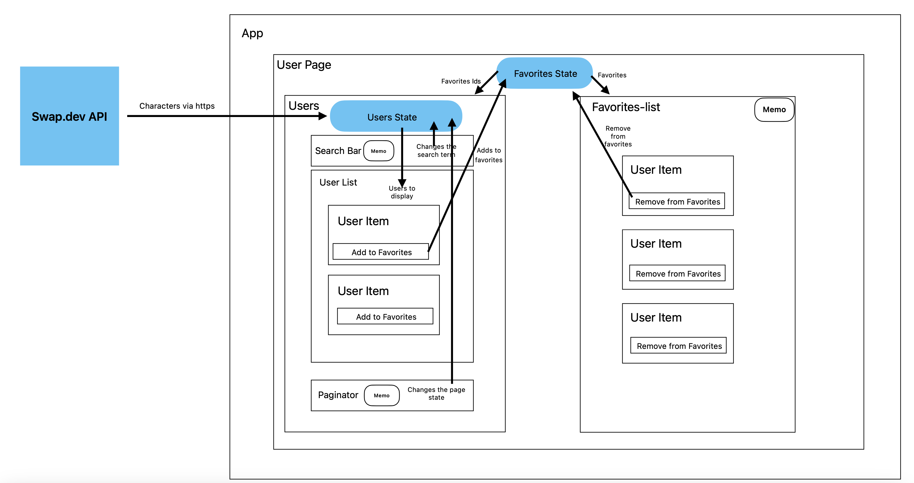

# Tech Design Guidelines

## How to Run the Application

Clone this repository to your local environment:

### `Git clone <this repo>`

Navigate to the BOND-APP and the run:

### `npm i`

To run the project run:

### `npm start`

This project was bootstrapped with [Create React App](https://github.com/facebook/create-react-app).

## Components

### app component

The root component of the application

### Users Page

The main and only page of this project
In this case for simplicity, the component holds the state of the favorites.

### Users

The left column of the the page holds the logic for fetching, displaying and searching the users

### User List

Displays a list of user items/ cards.
When clicking on the card the user details dialog is shown.
When clicking on add to favorites the user is added to the favorite list

### User item

A component that displays a card with the user name, image and a button.
The button text and functionality is given from the parent component

### User Details

A dialog that presents the user dialog and fetches the home world data on demand

### Search Bar

Holds the logic and the UI for the debounced search input

### Paginator

A custom paginator component

### Loader

A Custom loader based on basic HTML and css

### Favorites List

The right column of the page. Presents the list of favorite Users.
When clicking the remove from favorites the user is removed from the list and updates the User List so it will show the favorite badge.
You can change the color of the background on demand.

### Color Picker

A Basic color picker component

## Services

### User Service

A file that contains functions to fetch data and format it.

fetchUsers - uses fetchPeople to fetch ICharacterDTO and convert it to IUsers.

fetchPeople - fetches ICharacterDTO

fetchPlanet - fetches the users home world by url.

## State management

For simplicity in the case state manganate is handled locally were it is needed

### Users

For users State Management is handled in Users component

### Favorites

For favorites State Management is handled in the User Page component.
The reason is becaus the favorites State is needed both in favorite list and in users.

### Interaction Flow Diagram

